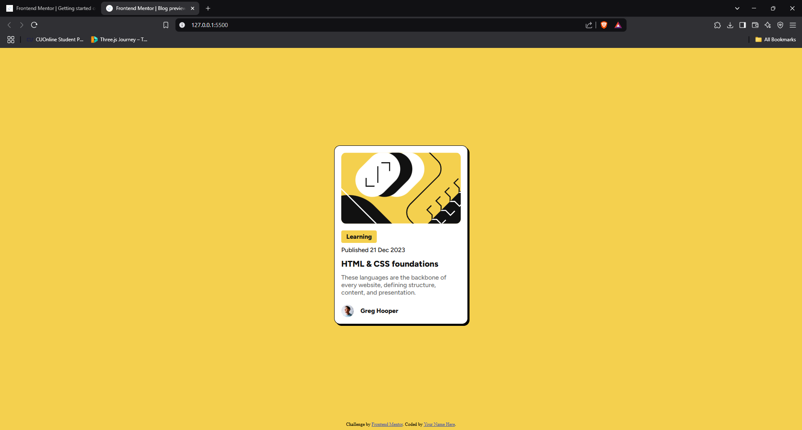

# Frontend Mentor - Blog preview card solution

This is a solution to the [Blog preview card challenge on Frontend Mentor](https://www.frontendmentor.io/challenges/blog-preview-card-ckPaj01IcS). Frontend Mentor challenges help you improve your coding skills by building realistic projects. 

## Table of contents

- [Overview](#overview)
  - [The challenge](#the-challenge)
  - [Screenshot](#screenshot)
  - [Links](#links)
- [My process](#my-process)
  - [Built with](#built-with)
  - [What I learned](#what-i-learned)
- [Author](#author)

## Overview

This is a solution to the challenge available on the [Frontend Mentors](https://www.frontendmentor.io/). The task of this challenge is to create a stunning blog preview card.The challenge is completed with the help of HTML and CSS.

### The challenge

Users should be able to:
- See hover and focus states for all interactive elements on the page

### Screenshot



### Links

- Solution URL: [GitHub Repo for the Solution](https://github.com/FA23BCS233/blog-preview-card.git)
- Live Site URL: [https://your-live-site-url.com](https://fa23bcs233.github.io/blog-preview-card/)

## My process

First I observed the card its element and note down the structure of HTML and then prepared the Markup (HTML) for the challenge and styled it with CSS. Then I added the hover state and focus state to the blog card.

### Built with

- Semantic HTML5 markup
- CSS custom properties
- Flexbox

### What I learned

I learned to complete the challenges and how to write a good HTML for smooth development process.

To see how you can add code snippets, see below:

```html
 <main>
    <div class="blog-preview-card" tabindex="0">
      <div class="img-container">
        
      </div>
  
      <div class="blog-details">
        <div class="tag">Learning</div>
        <div class="p-details">Published 21 Dec 2023</div>
        <h1>HTML & CSS foundations</h1>
        <p>
          These languages are the backbone of every website, defining structure, content, and presentation.
        </p>
      </div>
  
      <div class="avatar-container">
         Greg Hooper
      </div>
    </div>
  </main>
```
```css
main{
    height: calc(100vh - 20px);
    width: 100vw;
    display: flex;
    align-items: center;
    justify-content: center;
}

.blog-preview-card{
    width: 320px;
    background-color: var(--white);
    padding: 16px;
    border-radius: 14px;
    font-family: "Figtree" , serif;
    font-weight: var(--p-font-weight);
    font-size: var(--p-font-size);
    border: 1px solid black;
    box-shadow:  4px 4px 0px black;
    color: var(--gray-900);
    cursor: pointer;
}

.img-container  img{
    width: 100%;
    object-fit: cover;
    border-radius: 12px ;
}

.tag{
    display: inline-block;
    margin: 12px 0px 8px 0px;
    padding: 6px 12px;
    border-radius: 4px;
    background-color: var(--yellow);
    font-weight: var(--h-font-weight);
}

.p-details{
    margin-bottom: 12px;
}

.blog-details h1{
    font-size: 20px;
    font-weight: var(--h-font-weight);
    margin-bottom: 12px;
}

.blog-details p{
    color: var(--gray-500);

}

.avatar-container{
    display: flex;
    align-items: center;
    gap: 16px;
    margin-top: 20px;
    font-weight: var(--h-font-weight);
}

.blog-preview-card:hover .blog-details h1{
    color: var(--yellow);
}

.blog-preview-card:focus{
    outline: 2px dashed black;
    outline-offset: 10px;
}

.avatar-container img{
    height: 30px;
    width: 30px;
}
```


## Author

- Name - [Muhammad Arham](#)
- Frontend Mentor - [@FA23BCS233](https://www.frontendmentor.io/profile/FA23BCS233)
- Gmail - [arhamrafiq.com@gmail.com](arhamrafiq.com@gmail.com)
